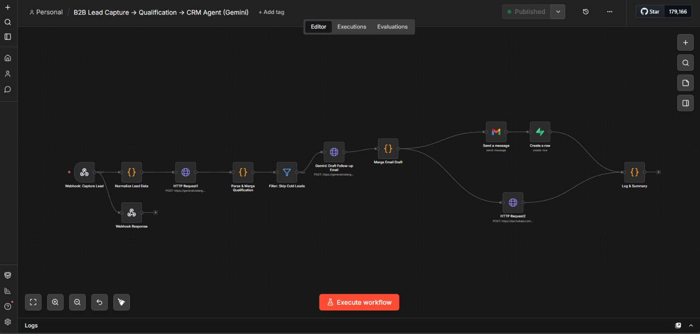

# ⚡ B2B Lead Capture → Qualification → CRM Agent

> A fully automated B2B lead pipeline built with **n8n**, **Gemini AI**, **HubSpot**, **Supabase**, and **Gmail** — qualifies leads, drafts personalized emails, and syncs to CRM in under 60 seconds.

---

## 📸 Workflow



---

## 🚀 What It Does

| Step | Action | Tool |
|------|--------|------|
| 1 | Captures lead via webhook or HTML form | n8n Webhook |
| 2 | Normalizes & validates lead data | n8n Code Node |
| 3 | AI scores lead 1–10 and tiers as Hot / Warm / Cold | Gemini 1.5 Flash |
| 4 | Filters out Cold leads automatically | n8n Filter |
| 5 | AI drafts a personalized follow-up email | Gemini 1.5 Flash |
| 6 | Sends email to the lead | Gmail OAuth2 |
| 7 | Creates contact in CRM | HubSpot REST API |
| 8 | Stores full lead record + token usage | Supabase PostgreSQL |
| 9 | Logs execution summary | n8n Code Node |

---

## 🏗️ Architecture

```
Webhook (POST)
     │
     ├──► Webhook Response (200 OK immediately)
     │
     ▼
Normalize Lead Data
     │
     ▼
Gemini: Qualify Lead  ──► Parse & Merge Qualification
                                    │
                          Filter: Skip Cold Leads
                                    │
                          ┌─────────▼──────────┐
                          │                    │
                  Gemini: Draft Email     (Cold → dropped)
                          │
                   Merge Email Draft
                          │
               ┌──────────┴──────────┐
               │                     │
         Gmail: Send            HubSpot: Create Contact
               │
        Supabase: Create Row
               │
          Log & Summary
```

---

## 🛠️ Tech Stack

| Tool | Purpose |
|------|---------|
| [n8n](https://n8n.io) | Workflow automation engine (self-hosted on Render) |
| [Gemini 1.5 Flash](https://aistudio.google.com) | AI lead scoring + email writing |
| [Gmail OAuth2](https://gmail.com) | Automated follow-up email sending |
| [HubSpot](https://hubspot.com) | CRM — contact management |
| [Supabase](https://supabase.com) | PostgreSQL database — lead storage + analytics |

---

## 📋 Prerequisites

- [n8n](https://n8n.io) instance (self-hosted or cloud)
- Google Gemini API key — [aistudio.google.com](https://aistudio.google.com)
- Gmail account with OAuth2 connected in n8n
- HubSpot free account + Private App token
- Supabase free project

---

## ⚙️ Setup

### 1. Clone & Import Workflow

```bash
git clone https://github.com/YOUR_USERNAME/b2b-lead-agent.git
```

Import `b2b_lead_agent_gemini_workflow.json` into n8n:
- n8n → Workflows → Import from file

---

### 2. Set Up Supabase Database

Go to **Supabase → SQL Editor → New Query** and run:

```sql
CREATE TABLE IF NOT EXISTS public.leads (
  id                  UUID DEFAULT gen_random_uuid() PRIMARY KEY,
  email               TEXT UNIQUE NOT NULL,
  name                TEXT,
  company             TEXT,
  role                TEXT,
  phone               TEXT,
  website             TEXT,
  employees           TEXT,
  budget              TEXT,
  message             TEXT,
  source              TEXT DEFAULT 'webhook',
  score               INTEGER CHECK (score BETWEEN 1 AND 10),
  tier                TEXT CHECK (tier IN ('Hot', 'Warm', 'Cold')),
  icp_match           BOOLEAN DEFAULT false,
  reasoning           TEXT,
  recommended_action  TEXT,
  email_sent          BOOLEAN DEFAULT false,
  prompt_tokens       INTEGER DEFAULT 0,
  completion_tokens   INTEGER DEFAULT 0,
  total_tokens        INTEGER DEFAULT 0,
  estimated_cost_usd  NUMERIC(10,6) DEFAULT 0,
  captured_at         TIMESTAMPTZ,
  qualified_at        TIMESTAMPTZ,
  updated_at          TIMESTAMPTZ DEFAULT now(),
  created_at          TIMESTAMPTZ DEFAULT now()
);
```

Get your credentials:
- **Project URL**: Project Settings → API → Project URL
- **API Key**: Project Settings → API → `service_role` secret key

---

### 3. Set Up HubSpot Private App

1. HubSpot → **Settings → Integrations → Private Apps**
2. Click **Create a private app**
3. Name: `n8n Lead Agent`
4. Scopes tab → enable:
   - `crm.objects.contacts.read`
   - `crm.objects.contacts.write`
5. Click **Create app** → copy `pat-na2-...` token

---

### 4. Configure n8n Credentials

| Credential | Type | Details |
|-----------|------|---------|
| Gemini API | Query parameter in HTTP Request URL | `?key=YOUR_GEMINI_KEY` |
| Gmail | Gmail OAuth2 | Sign in with Google in n8n |
| HubSpot | HTTP Header Auth | `Authorization: Bearer pat-na2-...` |
| Supabase | Supabase API | Host + service_role key |

---

### 5. Activate & Test

1. Click **Publish** in n8n (green dot = active)
2. Send a test request to your webhook

---

## 🧪 Testing

### Using ReqBin (No-code)

1. Go to [reqbin.com](https://reqbin.com)
2. Method: `POST`
3. URL:
```
https://YOUR-N8N-INSTANCE/webhook/lead-capture
```
4. Body (JSON):
```json
{
  "name": "Minato",
  "email": "binner2392@gmail.com",
  "phone": "+91 9876543210",
  "company": "TechStartup.io",
  "role": "CTO",
  "website": "www.techstartup.io",
  "employees": "50-200",
  "budget": "$10k-$50k",
  "message": "We are scaling our engineering team rapidly and need an automated lead pipeline. Very interested in scheduling a demo as soon as possible.",
  "source": "website_form"
}
```
5. Click **Send** → Expected response:
```json
{
  "status": "received",
  "message": "Lead is being processed."
}
```

### Using the HTML Form

Open `lead_capture_form.html` in your browser — a full styled form that posts directly to your webhook.

---

## 🤖 AI Scoring Rubric

| Score | Tier | Criteria | Action |
|-------|------|----------|--------|
| 8–10 | 🔥 Hot | Decision-maker, clear pain point, mid/large company | Schedule demo |
| 5–7 | 🌤️ Warm | Relevant role, vague need | Send nurture email |
| 1–4 | ❄️ Cold | Unclear fit, no company info | Disqualified — dropped |

> Cold leads are filtered out before email, HubSpot, and Supabase — saving API costs and keeping your CRM clean.

---

## 📊 Viewing Results

### n8n Executions
- Click **Executions** tab → see every pipeline run with status and timing
- Click any execution → inspect data flowing through each node

### HubSpot Contacts
- `app.hubspot.com` → **CRM → Contacts**
- Filter by Lead Status, Lifecycle Stage, or Create Date

### Supabase
- `supabase.com` → your project → **Table Editor → leads**
- Built-in views: `hot_leads`, `daily_token_usage`, `lead_summary`

---

## 🗂️ Project Structure

```
b2b-lead-agent/
├── b2b_lead_agent_gemini_workflow.json   # n8n workflow export
├── lead_capture_form.html                # HTML lead capture form
├── supabase_leads_schema.sql             # Supabase table setup SQL
├── WorkFlow.jpeg                         # Workflow diagram
└── README.md                             # This file
```

---

## 🔧 Troubleshooting

| Problem | Fix |
|---------|-----|
| Webhook 404 | Click "Execute workflow" first, or use production URL (no `-test`) |
| Gemini returns empty | Check model name is `gemini-1.5-flash` not `gemini-2.5-flash` |
| All leads Cold | Check Parse & Merge node output — JSON parsing may be failing |
| Supabase duplicate key | Delete existing test row or change the test email |
| HubSpot 401 | Use Private App token (`pat-na2-...`), not old API key |
| Gmail won't connect | Use Gmail OAuth2 node — Render.com blocks SMTP ports |
| Production webhook not firing | Workflow must show green Published dot (top right of n8n) |
| n8n sleeping on Render | Use [UptimeRobot](https://uptimerobot.com) free tier to ping every 5 mins |

---

## 💡 How to Extend

- **Add Slack notifications** — notify your team when a Hot lead arrives
- **Add enrichment** — plug in Clearbit or Apollo.io before qualification
- **Add scheduling** — connect Calendly link in follow-up email for Hot leads
- **Add lead scoring dashboard** — build a Supabase Studio dashboard
- **Multi-language support** — ask Gemini to detect language and respond accordingly

---

## 📄 License

MIT — free to use and modify.

---

## 👩‍💻 Built By

**Samanvitha** — CredFieldAI  
Built with ❤️ using n8n, Google Gemini, HubSpot, and Supabase.

---

> ⚡ *This system removes human repetition from lead management — every lead gets qualified, followed up, and tracked automatically.*
